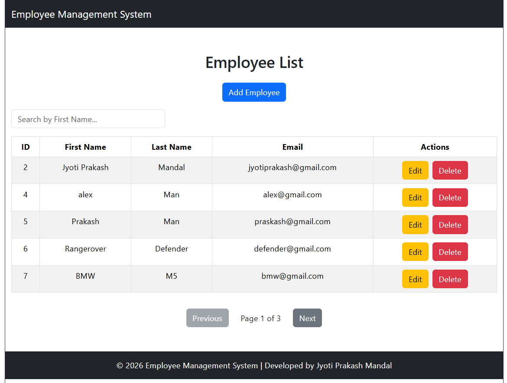
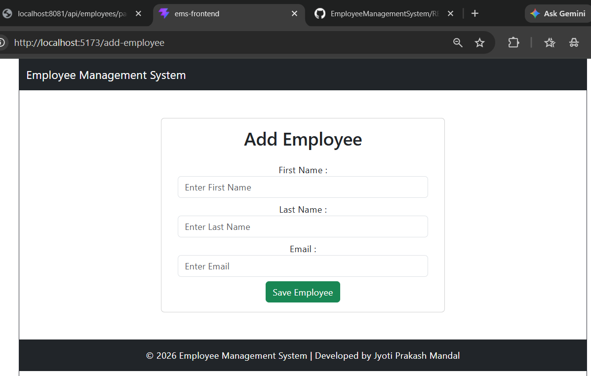
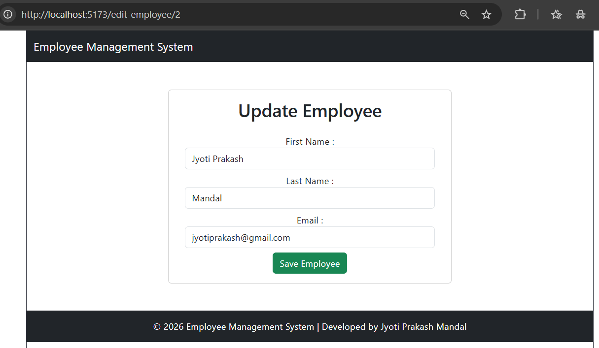
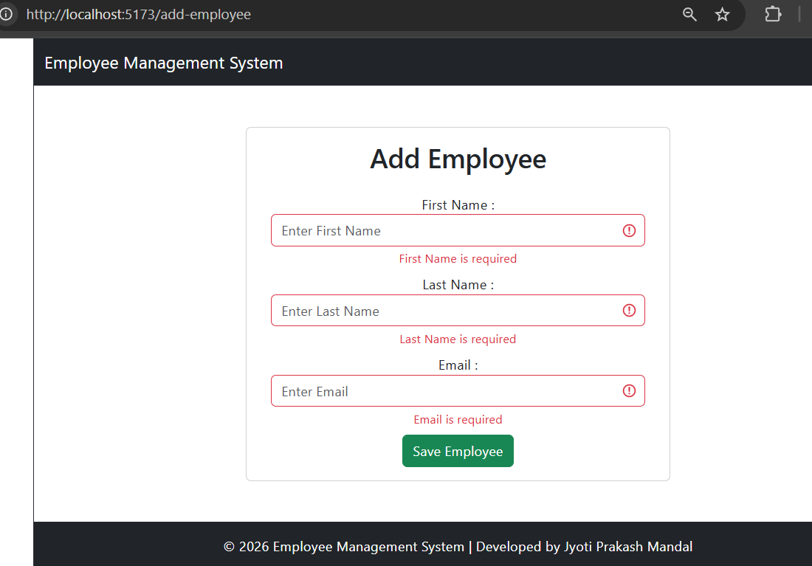
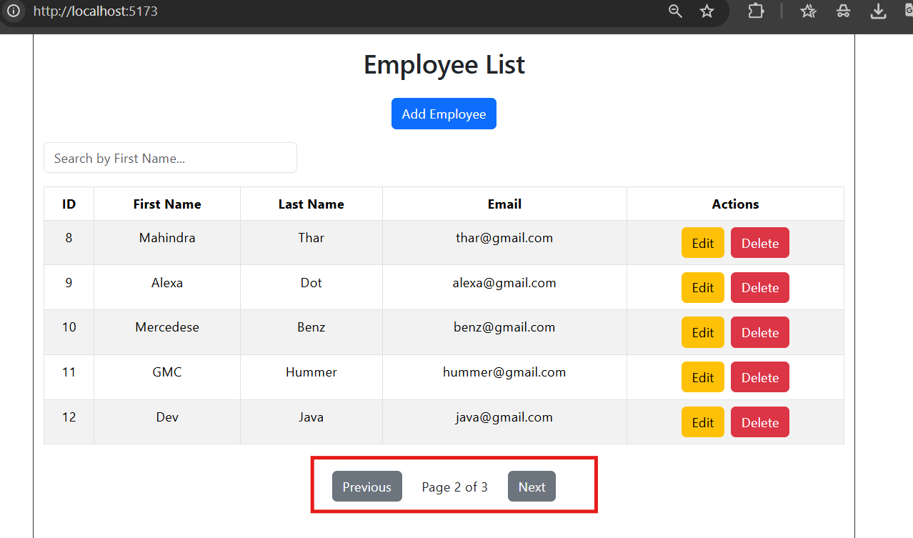
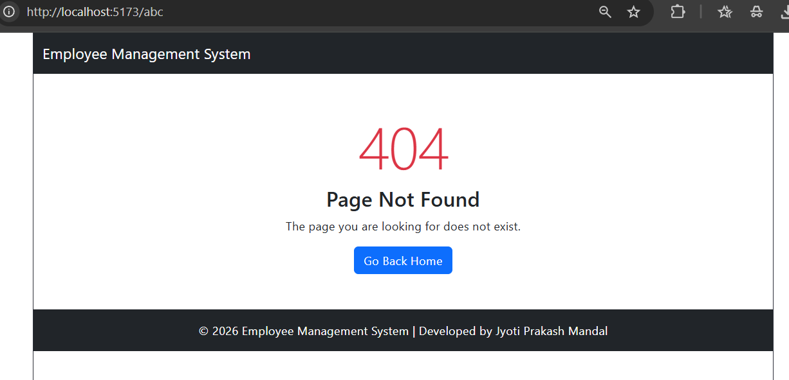

# Employee Management System

A Full Stack Employee Management System built using Spring Boot, React, MySQL, JPA, and REST APIs.

## Features

- Add Employee
- View Employee List
- Update Employee
- Delete Employee
- Search Employee by First Name
- Form Validation
- Pagination
- Responsive UI
- Custom 404 Page
- RESTful APIs

---

## Tech Stack

### Backend
- Java 21
- Spring Boot
- Spring Data JPA
- Hibernate
- MySQL

### Frontend
- React
- React Router
- Axios
- Bootstrap

### Tools
- Git
- GitHub
- Postman
- VS Code
- Eclipse IDE

---

## Project Structure

Backend
```
controller
service
repository
entity
exception
```

Frontend
```
components
services
App.jsx
main.jsx
```

---

## REST APIs

| Method | Endpoint | Description |
|--------|----------|-------------|
| GET | /api/employees | Get all employees |
| GET | /api/employees/{id} | Get employee by ID |
| POST | /api/employees | Add employee |
| PUT | /api/employees/{id} | Update employee |
| DELETE | /api/employees/{id} | Delete employee |
| GET | /api/employees/page | Get paginated employees |

---

## Screenshots

## Home Page



---

## Add Employee



---

## Edit Employee



---

## Form Validation



---

## Pagination



---

## 404 Page



---

## Future Enhancements

- Sorting
- Authentication
- Docker
- Deployment

---

## Author

**Jyoti Prakash Mandal**
